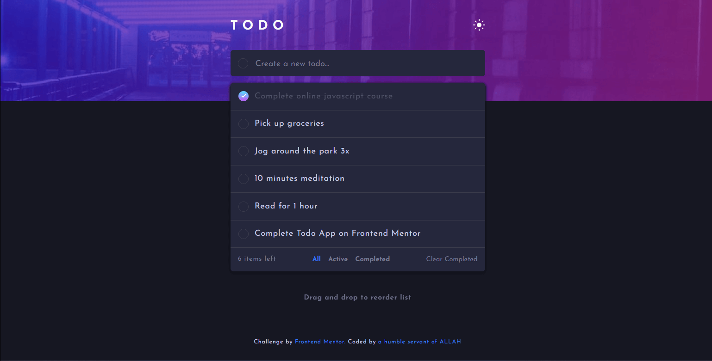

# Frontend Mentor - Todo app solution

This is a solution to the [Todo app challenge on Frontend Mentor](https://www.frontendmentor.io/challenges/todo-app-Su1_KokOW). Frontend Mentor challenges help you improve your coding skills by building realistic projects.

## Table of contents

- [Overview](#overview)
  - [The challenge](#the-challenge)
  - [Screenshot](#screenshot)
  - [Links](#links)
- [My process](#my-process)
  - [Built with](#built-with)
  - [What I learned](#what-i-learned)
  - [Continued development](#continued-development)
  - [Useful resources](#useful-resources)
- [Author](#author)
- [Acknowledgments](#acknowledgments)

### The challenge

Users should be able to:

- View the optimal layout for the app depending on their device's screen size
- See hover states for all interactive elements on the page
- Add new todos to the list
- Mark todos as complete
- Delete todos from the list
- Filter by all/active/complete todos
- Clear all completed todos
- Toggle light and dark mode
- **Bonus**: Drag and drop to reorder items on the list
- [additionally added] edit tasks when clicked on individual todos

### Screenshot

### Links

- Solution URL: [Add solution URL here](https://your-solution-url.com)
- Live Site URL: [Add live site URL here](https://servant-of-Allah.github.io/todoApp-fm)

## My process

### Built with

- Semantic HTML5 markup
- CSS custom properties
- Flexbox
- CSS Grid
- Mobile-first workflow
- [React](https://reactjs.org/) - JS library

### What I learned

this project helpend improve my React knowledge. Additionally i used the react-beautiful-dnd library for adding drag and drop functionality for the first time. it was a great experience. i got to learn about it's usage. the filtering section and conditional rendering helped too to deepen my understanding of them. i did not use any css library or framework. i wanted to improve and challenge my css skill too. and it did. overall i learnt many things along the way i didn't know before even if it's small.

### Continued development

in future i have the the intention to add the functionality to remember the users todos using localstorage. but for now i leave it here.

### Useful resources

-[stackoverflow](https://stackoverflow.com) how can i not mention this platform... -[Openbase](https://openbase.com) the tutorial on react-beautiful-dnd on openbase helped me greatly.

## Author

- Frontend Mentor - [@servant-of-Allah](https://www.frontendmentor.io/profile/servant-of-Allah)

## end
